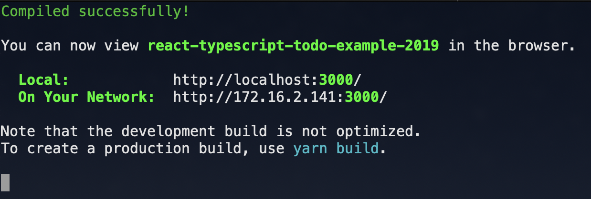

<!-- START doctoc generated TOC please keep comment here to allow auto update -->
<!-- DON'T EDIT THIS SECTION, INSTEAD RE-RUN doctoc TO UPDATE -->
**Table of Contents**  *generated with [DocToc](https://github.com/thlorenz/doctoc)*

- [React TypeScript Todo Example 2019 Mid](#react-typescript-todo-example-2019-mid)
  - [Play 👇](#play-)
  - [What's this?](#whats-this)
    - [Motivation](#motivation)
    - [Note 🗒](#note-%F0%9F%97%92)
  - [Stack](#stack)
  - [Prerequisites](#prerequisites)
  - [Installation](#installation)
  - [Run Webpack Dev Server](#run-webpack-dev-server)
  - [Run Production Build](#run-production-build)
  - [Cypress](#cypress)
      - [Runs Cypress tests from the CLI without the GUI](#runs-cypress-tests-from-the-cli-without-the-gui)
      - [Opens Cypress in the interactive GUI.](#opens-cypress-in-the-interactive-gui)
  - [Jest](#jest)
  - [Linting](#linting)
  - [Typecheck](#typecheck)
  - [Issues](#issues)
  - [Questions](#questions)
  - [LICENSE](#license)
  - [Contributors ✨](#contributors-)

<!-- END doctoc generated TOC please keep comment here to allow auto update -->

# React TypeScript Todo Example 2019 Mid

[](https://circleci.com/gh/ryota-murakami/react-typescript-todo-example-2019) [](https://cypress.io) [](https://github.com/facebook/jest) [](https://github.com/facebook/jest) [](https://github.com/prettier/prettier) 
[](#contributors)
[](https://app.netlify.com/sites/react-typescript-todo-example/deploys)

 <a href="https://react-typescript-todo-example.netlify.com/"></a>

## Play 👇
[](https://codesandbox.io/s/github/ryota-murakami/react-typescript-todo-example-2019/tree/master/?fontsize=14)

## What's this?
This is a [Create React App](https://facebook.github.io/create-react-app/) based [React](https://reactjs.org/) + [TypeScript](https://www.typescriptlang.org/) todo app example.  👉 [**DEMO**](https://react-typescript-todo-example.netlify.com)  
[TypeScript](https://www.typescriptlang.org/) coming from babel, set upped at [Create React App](https://facebook.github.io/create-react-app/) install option. [Adding TypeScript Doc](https://facebook.github.io/create-react-app/docs/adding-typescript#docsNav)📝  

### Motivation
Aftter React Conf 2018, It comming v16.8.0 with [Hooks](https://reactjs.org/docs/hooks-intro.html) that's apparently brand new way of Code Design contrast with class base 📝
In addition, TypeScript adopt so much easier into a `babel` + `wbpack` build system by [Create React App v2.1 TypeScript support](https://github.com/facebook/create-react-app/releases/tag/v2.1.0) official released.

So I was interested what kind of code design and configuration was built. if I build todo with a Hooks and TypeScript. 😀

### Note 🗒

**This is not a Best Practice introduction.  
There are tons of effective way to create solid software in JavaScript World, you have a lot of other option based on your preference for approaching where, The Repo is just a style of my favorite.**  

"*How to combining TypeScript with massive Babel or JavaScript tools ecosystem?*"

**I hope this helps you know like that from what I've Published!**


## Stack
- [TODO-CSS-Template](https://github.com/Klerith/TODO-CSS-Template)(Borrowing HTML & CSS Thanks! 👍 )
- [Create React App](https://facebook.github.io/create-react-app/)(ejected for remove eslint-lordar from webpack / [React@16.9.0](https://reactjs.org/blog/2019/08/08/react-v16.9.0.html))
- [TypeScript(Babel)](https://babeljs.io/docs/en/babel-plugin-transform-typescript)
- [ReachRouter](https://github.com/reach/router)
- [emotion](https://github.com/emotion-js/emotion): CSS-in-JS
- [muriatic](https://github.com/ryota-murakami/muriatic): Data Sharing Library
- [Cypress](https://www.cypress.io/): E2E Testing
- [react-testing-library](https://github.com/testing-library/react-testing-library)
- [ESLint](https://eslint.org/)
  - [eslint-plugin-prettier](https://github.com/prettier/eslint-plugin-prettier)
  - [@typescript-eslint/eslint-plugin](https://github.com/typescript-eslint/typescript-eslint#readme)
  - [eslint-plugin-react-hooks](https://reactjs.org/)
- [Netlify](https://www.netlify.com/): Deploy & Hosting
- [CircleCI](https://circleci.com/): Automation run tests, lint, typecheck, build, deploy


## Prerequisites

The app assumed installed Node.js newer than `10.16.3 LTS`.  
If you have not it yet, follow the official [Node.js Doc](https://nodejs.org/en/) to install it.

## Installation

```
git clone git@github.com:ryota-murakami/react-typescript-todo-example-2019.git
cd react-typescript-todo-example-2019
yarn install # or npm install
```

## Run Webpack Dev Server

```bash
yarn start
```

After that you'll seen the console which are server processes messages.  
Let's follow the message and put in URL `http://localhost:3000/` your browsers adressbar,   
and then you'll got todo app as same as Demo. let's modify under the `src/` code feel free!!

Official Docs: https://create-react-app.dev/docs/getting-started#npm-start-or-yarn-start



## Run Production Build

```bash
yarn build
```

After that You'll get bundled and optimization stuff in `build` directory.  
Also you can run production build with `serve` local webserver modules.  

```bash
  yarn global add serve
  serve -s build
```

Official Docs: https://create-react-app.dev/docs/getting-started#npm-run-build-or-yarn-build

## Cypress
[Cypress](https://www.cypress.io/) is all-in-one E2E Testing tool which can deal real browser testing.  


#### Runs Cypress tests from the CLI without the GUI
```baash
yarn start # Launch DevServer
yarn cypress:run
```

#### Opens Cypress in the interactive GUI.

```bash
yarn start # Launch DevServer
yarn cypress:open
```

## Jest
[Jest](https://jestjs.io/) is all-in-one test-runner built in [Create React App](https://facebook.github.io/create-react-app/) and covers function-level unit testing to component-behavior-level integration testing.  
The Repo use to [react-testing-library](https://github.com/testing-library/react-testing-library) for component integration testing.

```bash
# run jest
yarn test
# run jest with hide console message except jest infomation
yarn test --silent
```

If you run `yarn test`, you'll see console.error message on termianl because `ErrorBoundary.test.js` contain invalid react component on purpose.  
`--silent` option hide that error.

## Linting
[ESLint](https://eslint.org/) is at the top.  
And setup [TypeScript ESLint](https://github.com/typescript-eslint/typescript-eslint), mixing [Prettier](https://prettier.io/) as a [eslint-plugin-prettier](https://github.com/prettier/eslint-plugin-prettier).

```bash
# run lint only
yarn lint

# run wtih eslint --fix option
yarn lint:fix
```

## Typecheck
While developing and building, Babel stop transpile with TS error messages.  
I can't find way static typecheck with babel,  
so I'm using original TypeScript via npm and specified `tsc --noEmit` compile option that doesn't generate compiled code.  

```bash
yarn typecheck
```

## Issues
Please feel free to post [New Issue](https://github.com/ryota-murakami/react-typescript-todo-example-2019/issues/new) or Pull Request 🤗

## Questions
Please feel free to post [New Issue](https://github.com/ryota-murakami/react-typescript-todo-example-2019/issues/new) or reply on [Twitter](https://twitter.com/malloc007) 🐦  

If you want to get more generally answers, these community are might be helpful 🍻

- [Spectrum](https://spectrum.chat/react?tab=posts)
- [Reactiflux on Discord](https://www.reactiflux.com/)
- [Stack Overflow](https://stackoverflow.com/questions/tagged/reactjs)

## LICENSE
MIT

## Contributors ✨
Thanks goes to these wonderful people ([emoji key](https://allcontributors.org/docs/en/emoji-key)):

<!-- ALL-CONTRIBUTORS-LIST:START - Do not remove or modify this section -->
<!-- prettier-ignore -->
<table>
  <tr>
    <td align="center"><a href="http://ryota-murakami.github.io/"><br /><sub><b>ryota-murakami</b></sub></a><br /><a href="https://github.com/ryota-murakami/react-typescript-todo-example-2019/commits?author=ryota-murakami" title="Code">💻</a> <a href="https://github.com/ryota-murakami/react-typescript-todo-example-2019/commits?author=ryota-murakami" title="Documentation">📖</a> <a href="https://github.com/ryota-murakami/react-typescript-todo-example-2019/commits?author=ryota-murakami" title="Tests">⚠️</a></td>
    <td align="center"><a href="http://donkeycar.com"><br /><sub><b>Will Roscoe</b></sub></a><br /><a href="https://github.com/ryota-murakami/react-typescript-todo-example-2019/commits?author=wroscoe" title="Code">💻</a></td>
  </tr>
</table>

<!-- ALL-CONTRIBUTORS-LIST:END -->

This project follows the [all-contributors](https://github.com/all-contributors/all-contributors) specification. Contributions of any kind welcome!
